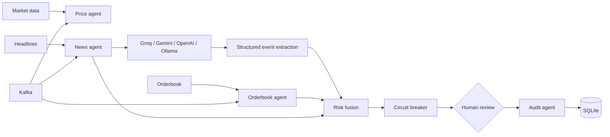
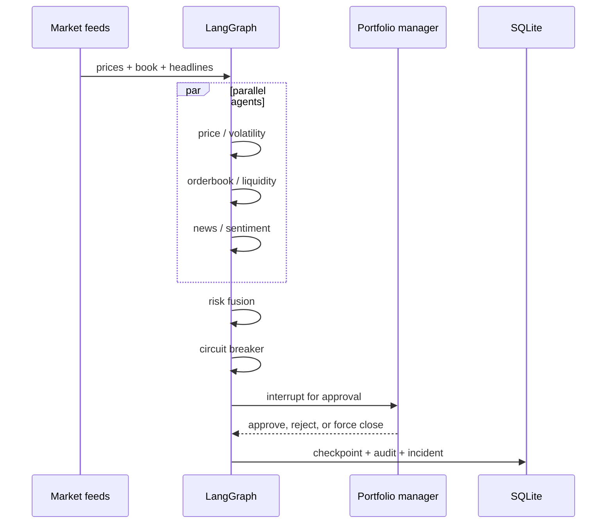

# FinGuard

FinGuard is a portfolio-grade risk governance system for algorithmic trading. It does not place trades. It observes market data, simulated order flow, news risk, portfolio exposure, and drawdown; then it pauses execution when governance limits are breached.

The enterprise upgrade adds Binance ticker streaming for BTCUSDT, ETHUSDT, and a NIFTY proxy, YFinance fallback, persistent transition history, durable SQLite LangGraph checkpoints, checkpoint diff replay, PDF audit export, VaR, expected shortfall, concentration and sizing risk, correlation risk, regime-aware thresholds, portfolio analytics, structured JSON logging, and a Kafka event transport.

## Architecture



The graph uses LangGraph `Send` for parallel analysis, the SQLite-backed `SqliteSaver` for durable checkpoints, and `interrupt()` for human approval. LangChain integrations use structured Pydantic output; `mock` is deterministic and offline-friendly, while Groq, Gemini, OpenAI, and Ollama invoke their configured models and fall back safely if unavailable.

## Workflow



## Run locally

```powershell
python -m venv .venv
.\.venv\Scripts\Activate.ps1
pip install -r requirements.txt
$env:PYTHONPATH = (Get-Location).Path
uvicorn fin_guard.api.main:app --reload
streamlit run fin_guard/frontend/streamlit_app.py
```

API docs are available at `http://127.0.0.1:8000/docs`; the dashboard runs at `http://localhost:8501`.

## API surface

`GET /health`, `/risk`, `/positions`, `/audit`, `/checkpoints`, `/feed`, `/replay/{thread_id}`, and `/audit/report/{incident_id}`; `POST /approve`, `/reject`, `/force-close`, `/simulate-market`, `/simulate-crash`, and `/simulate-trading-day`.

## Configuration

Set these values in the project-root `.env` file to use Groq:

```dotenv
LLM_PROVIDER=groq
LLM_MODEL=llama-3.3-70b-versatile
GROQ_API_KEY=your_groq_api_key
```

Then start the dashboard with `streamlit run fin_guard/frontend/streamlit_app.py`. Groq uses its OpenAI-compatible endpoint through `langchain-openai`; do not commit `.env` or expose the key in source code. The supported providers are `mock`, `groq`, `openai`, `gemini`, and `ollama`. The mock provider is deterministic and used by default for local tests. Binance connectivity is opportunistic; the feed automatically falls back to YFinance-compatible data when the socket is unavailable.

## Risk analytics

The risk fusion node records historical VaR, expected shortfall, maximum position concentration, position sizing utilization, correlation risk, Sharpe ratio, Sortino ratio, equity curve, drawdown curve, and daily PnL. The regime agent adjusts the volatility breaker limit for bull, bear, sideways, and high-volatility regimes.

## Replay and audit

Each API graph run writes state transitions into SQLite. The Checkpoint Replay page shows a selectable thread, step number, node, state, and before/after diff. Audit Center provides a timeline, root-cause narrative, incident decision history, and a downloadable PDF report.

## Testing

```powershell
$env:PYTHONPATH = (Get-Location).Path
pytest -q
```

The current regression suite contains 32 passing cases across agents, graph execution, interrupt recovery, API endpoints, WebSocket URL/fallback contracts, analytics, replay, durable checkpoint reopening, Kafka fallback, lifecycle accounting, JSON logging, and PDF export.

## Screenshots

Run the dashboard and capture the Overview, Risk monitor, Audit center, and Approval queue views for a portfolio presentation. The `flash_crash` scenario gives a reproducible incident with a 12% drawdown and a paused execution state.

## Future enhancements

- Replace the deterministic sentiment adapter with structured JSON output from a selected LLM.
- Add authenticated WebSocket feeds and broker execution adapters.
- Add role-based approval policies, immutable audit export, and richer checkpoint replay.
- Add portfolio VaR, stress testing, and multi-account netting.

## Recruiter summary

This project demonstrates event-driven Python architecture, typed state design, parallel LangGraph orchestration, human-in-the-loop controls, risk scoring, async data ingestion, FastAPI APIs, Streamlit observability, and SQLite auditability.

### Resume bullets

- Built a LangGraph risk governance engine with parallel price, orderbook, and news agents that fuses signals into a 0-100 risk score.
- Implemented interrupt-driven circuit breakers, operator approvals, checkpoint persistence, incident tracking, and replayable audit logs.
- Delivered FastAPI control APIs and a Plotly/Streamlit dashboard for live risk monitoring and flash-crash simulation.

### Interview questions

**Why use a graph?** It makes state transitions explicit, testable, checkpointable, and easy to extend with additional governance nodes.

**Why is the news provider abstracted?** Risk policy should not depend on one vendor, API key, or model. A protocol keeps the graph stable while providers change.

**How is this different from a trading bot?** It has no strategy or order placement logic. Its authority is governance: observe, explain, pause, request approval, and record.
